# DrillTek - All Things Diamond Drilling, All In One Place

## About This Application
DrillTek is a web based solution for managing and logging boreholes in extractive industry. The application is three tier, with the presentation tier being built using Svelte and Bulma CSS, the application tier Api using Django rest framework and the Data tier comprising a Postgresql database. Users can create borehole programs comprised of individual boreholes and upload geological logging information associated with them. This application was constructed using fully open source tools due to similar industrial applications carrying a large license fee.

## Installation 
Ensure that docker is installed on running machine and download this repo. 

Create .env file at root of project and populate with contents of .envExample file

```
DBPASSWORD=YOUR DBPASSWORD
SECRET_KEY=YOUR DJANGO SECRET_KEY
DB_NAME=YOUR DB NAME
DB_USER=YOUR DB USER NAME
DB_HOST=YOUR HOST IP
DB_PORT=YOUR DB PORT 
```
Replace values with your desired properties.

Run intial command from terminal using:
```
docker compose up --build
```
This will create images for DrillTek Frontend, DrillTek Backend and Drilltek DB and then run containers from these images. 

Once running, access Client from:
http://localhost:5173/

Following inital build, destroy containers using:
```
docker compose down
```
And rebuild containers using 
```
docker compose up
```

## First Login

Given the application is still in development, a test user has been generated for testing the application. This application is designed for an admin to create users within 
Postgresql and issue users with a user email and password. 

Test user details are:
```
email:j.owen@drilltek.com
password:secretsecretsecret
```

On initial login, password change will be prompted before login. Be aware that passwords are required to be minimum 15 characters as per NIST advice. 

## Application details
At present , users will have access to an area for managing boreholes called 'drilling portal' and an area for logging drillholes called 'logging portal'.
On login these will be present from the main portal.

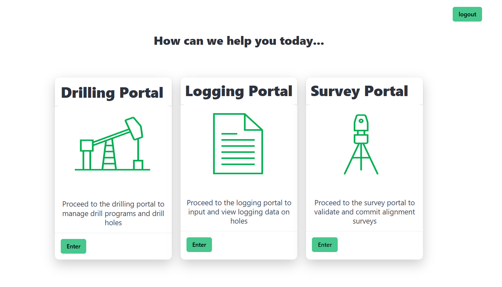

### Drilling portal
#### Drill Programs

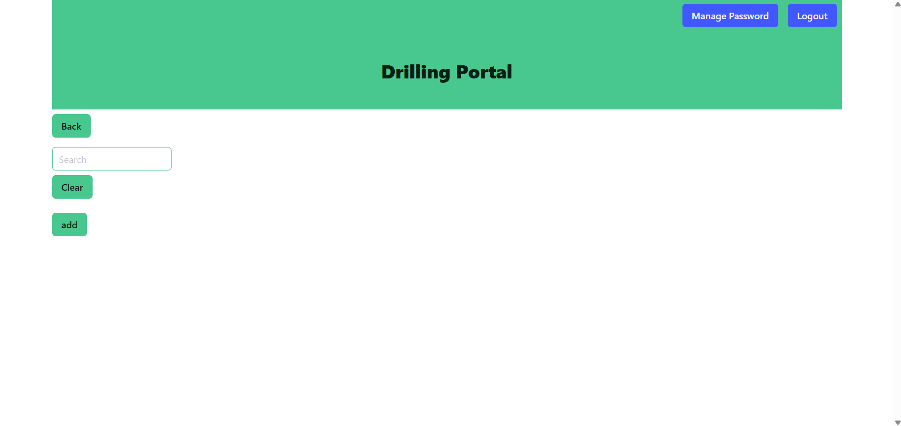

On entering the drilling portal, a blank page will be encountered due to no drill programs yet added. Programs can be added using the 'Add button' and populating the 
subsequent form. 

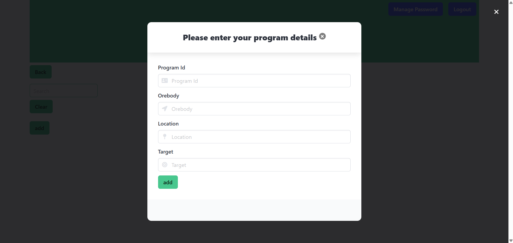

Be aware that fields have character length constraints as outlined below and in drilltekBackend/api/models.py

```Python
    programid = models.CharField(primary_key=True,max_length=30)
    orebody = models.CharField(max_length=10)
    location = models.CharField(max_length=10)
    target = models.CharField(max_length=10)
```
Drill programs can be opened to view details and edit by selecting open on the desired program

#### Drill Program Details

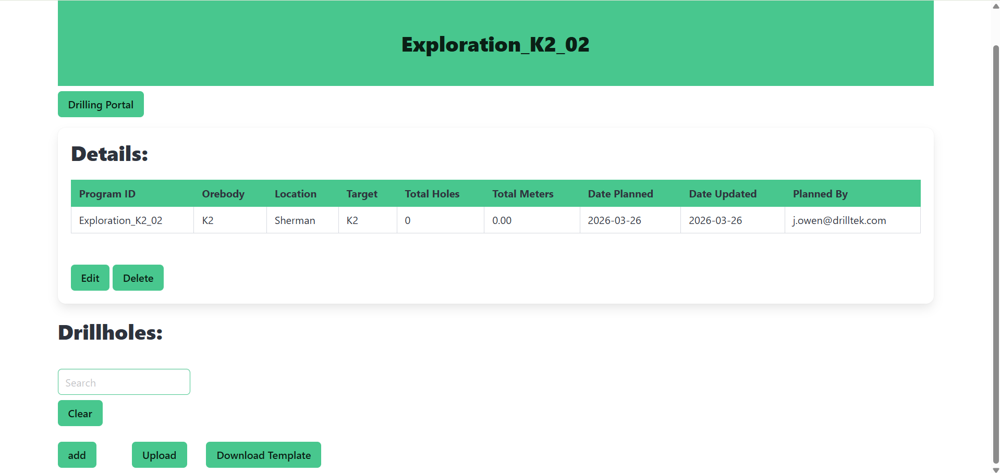

Upon opening desired drill program , users have the option to manipulate the existing program or add drillholes. 

Selecting 'Edit' Will present the user with a prepopulated form containing the current details. These can be edited and resubmitted. 


Selecting 'Delete' Will prompt the user to make sure they want to delete the program. **Please be aware that by deleting a program this will cascade and delete
associated drillholes and also any logs associated with said holes**. 

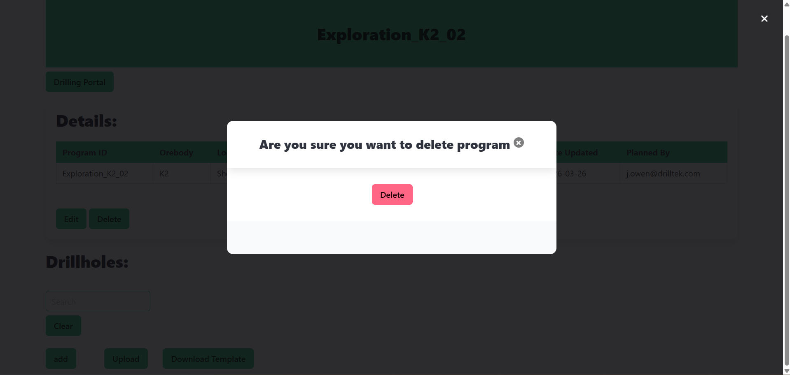

Drillholes can be uploaded to a program in two ways: 

Individually, by selecting 'add':

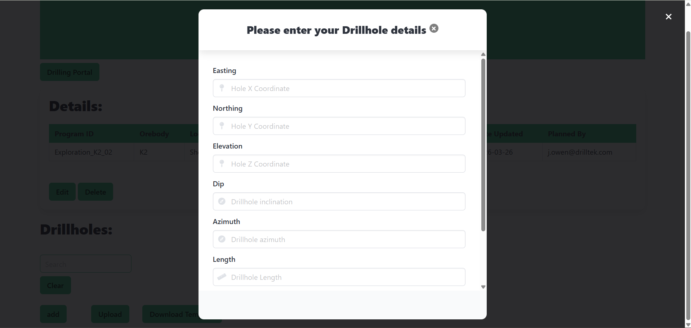

Or in bulk by selecting upload:

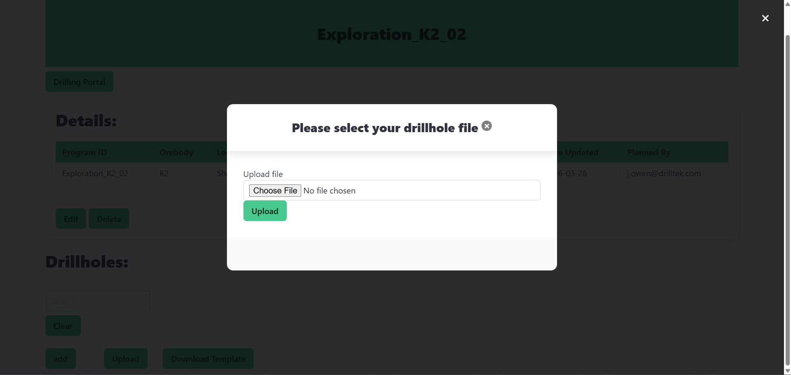

Uploading file format is .csv and it is advised that users first **download and populate the template provided to avoid running into upload issues**. 

Users should be aware of character limits on drillhole fields 

```Python
 xcoord = models.DecimalField(decimal_places=2, max_digits=8)
    ycoord = models.DecimalField(decimal_places=2, max_digits=8)
    zcoord = models.DecimalField(decimal_places=2, max_digits=8)
    dip = models.DecimalField(decimal_places=2, max_digits=4, 
                              validators=[
                                  MinValueValidator(-90.00),
                                  MaxValueValidator(90.00)
                              ])
    azimuth = models.DecimalField(decimal_places=2, max_digits=5,
                                  validators=[
                                      MinValueValidator(0.01),
                                      MaxValueValidator(360.00)
                                  ])
    length = models.DecimalField(decimal_places=2, max_digits=8, 
                                 validators=[
                                     MinValueValidator(1.00),
                                     MaxValueValidator(100000.00)
                                 ])
```

#### Drillhole details

Drillholes can be opened inside a drill program by selecting 'open' beside each drill program

This will display details about the hole and provides options to:

Edit a drillhole:
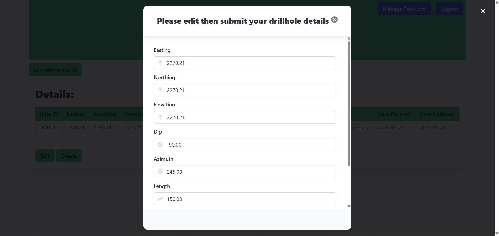

Delete:
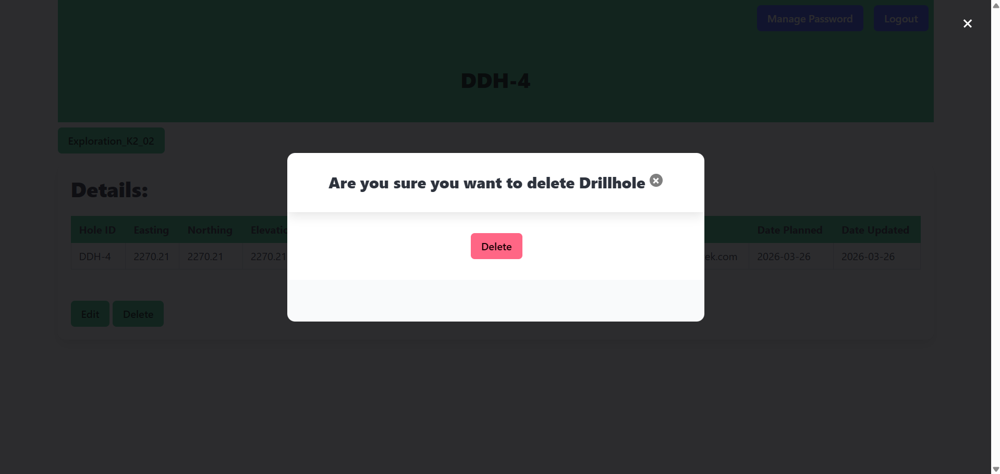

Users should be aware that **deleting a drillhole will cascade and delete all associated logs**

### Logging Portal

Users can access the logging portal from the main portal

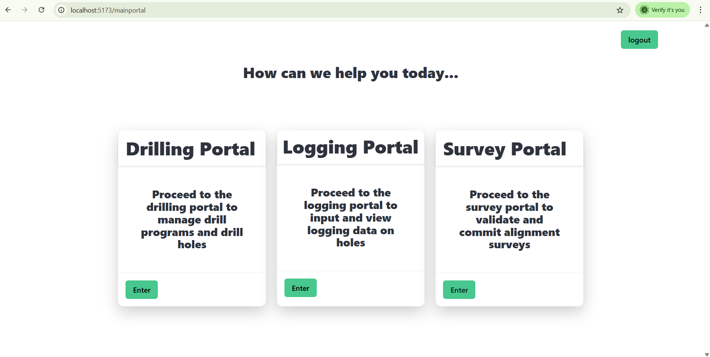

#### Logging portal programs

Upon entering, users will be presented with a list of drill programs.

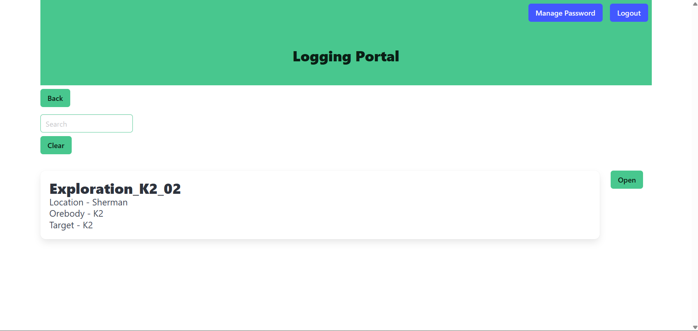

#### Logging portal drillholes

Users can navigate to the selected drill program and open the desired drillhole for logging, using the searchbar if required

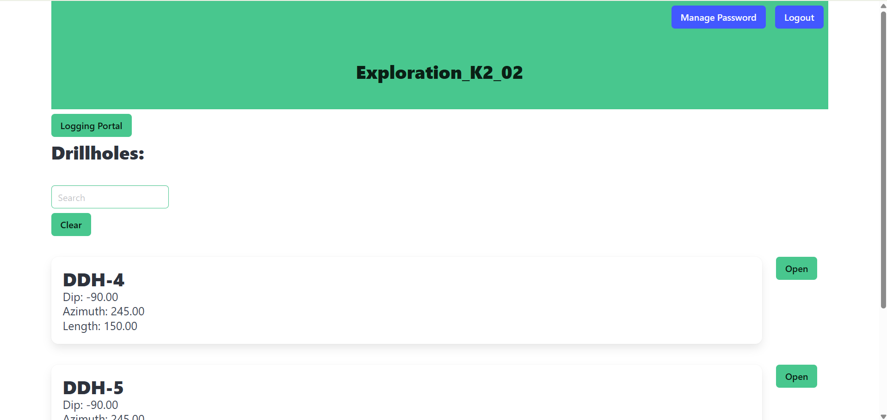

#### Logging portal logs

Upon entering the desired drillhole for logging users are able to enter logging information using several tabs: Lithology, Alteration, structure and Mineral which can be toggled between whilst retaining information

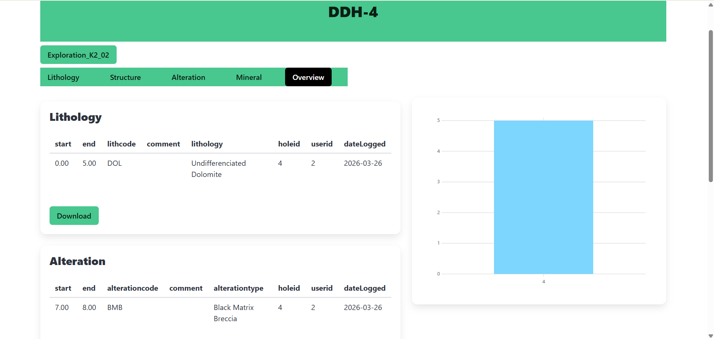

Below are the constraints on each table inputs where table codes are controlled by dropdown list and therefore not editable directly:

```Python
#LITHOLOGY
 start = models.DecimalField(decimal_places=2, max_digits=8,
                                validators=[
                                    MaxValueValidator(100000.00)
                                ])
    end = models.DecimalField(decimal_places=2, max_digits=8,
                                validators=[
                                    MaxValueValidator(100000.00)
                                ])
    lithcode = models.CharField(choices=lithcodes)
    comment = models.CharField(max_length=500 , blank=True)
```

```Python
#ALTERATION
start = models.DecimalField(decimal_places=2, max_digits=8,
                            validators=[
                                MaxValueValidator(100000.00)
                            ])
    end = models.DecimalField(decimal_places=2, max_digits=8,
                            validators=[
                                MaxValueValidator(100000.00)
                            ])
    alterationcode = models.CharField(choices=alterationcodes)
    comment = models.CharField(max_length=500, blank=True)
```

```Python
#STRUCTURE
start = models.DecimalField(decimal_places=2, max_digits=8,
                            validators=[
                                MaxValueValidator(100000.00)
                            ])
    end = models.DecimalField(decimal_places=2, max_digits=8,
                            validators=[
                                MaxValueValidator(100000.00)
                            ])
    structurecode = models.CharField(choices=structurecodes)
    comment = models.CharField(max_length=500, blank=True)
    structuretype = models.CharField(max_length=35)
    dip = models.IntegerField(validators=[
        MaxValueValidator(90)
    ])
```

```Python
#MINERAL
sampleid = models.CharField(primary_key=True,max_length=10)
    start = models.DecimalField(decimal_places=2, max_digits=8,
                            validators=[
                                MaxValueValidator(100000.00)
                            ])
    end = models.DecimalField(decimal_places=2, max_digits=8,
                            validators=[
                                MaxValueValidator(100000.00)
                            ])
    estimate = models.DecimalField(decimal_places=2, max_digits=5,
                                   validators=[
                                       MinValueValidator(0.00),
                                       MaxValueValidator(100.00)
                                   ])
     comment = models.CharField(max_length=500, blank=True)
     texture = models.CharField(choices=texturechoices)
```

It should be noted that users should save these individually when satisfied.

Upon save and page reload, an overview tab will appear outlining the contents of each log. Each log can be exported as .csv by selecting the button associated with log if required. 


### Logout and Change password

It should be noted that users can logout of the application at any time using the logout button from any page


Users may choose to change their password in any page aside from the main portal by selecting the option at the top of the hero banner


## API Useage 

The DrillTek API can be configured to be reached from other applications using HTTP. The base URL for the making HTTP requests is http://drilltekbackend:8000/api/

The full list of API endpoints can be found in /drilltekBackend/api/urls.py. 

Users should consult /drilltekBackend/api/views.py for associated views outlining Params and bodies required for request.

It should be noted that protected viewsets are flagged by 

```Python
permission_classes=[IsAuthenticated]
```

The endpoints associated with these views require contacting generating an access token using:

```
http://drilltekbackend:8000/api/user/login
BODY
{email: valid user email,
password: valid user password}
```

Currently, endpoints are optimised to be used in conjunction with the client application but can be accessed using HTTP requests via other applications, postman or using CURL


